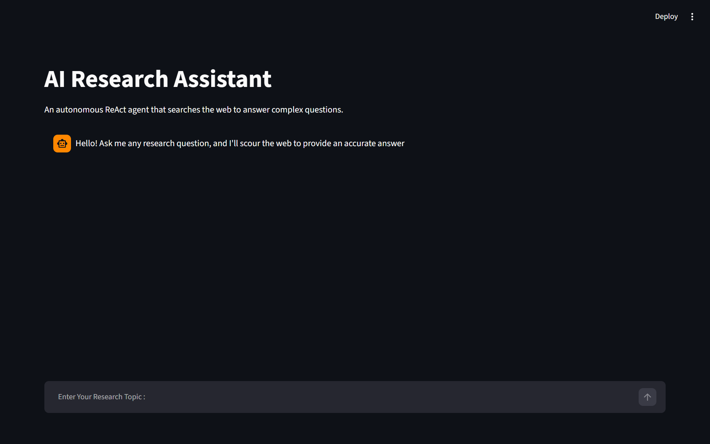

# AI Research Assistant

## 🚀 About
An AI-powered research assistant that searches the web in real-time using Tavily API, summarizes findings with Groq LLM, and provides cited answers.

## 🛠️ Tech Stack
- Python, Streamlit, LangChain, Groq API, Tavily API

## ✨ Features
- Real-time web search via Tavily
- AI-powered summarization
- Source citations

## 🔗 Live Demo

## 📷 ScreenShots

## ⚙️ How to Run
1. Clone repo
2. `pip install -r requirements.txt`
3. Add `.env` with GROQ_API_KEY and TAVILY_API_KEY
4. `streamlit run main.py`